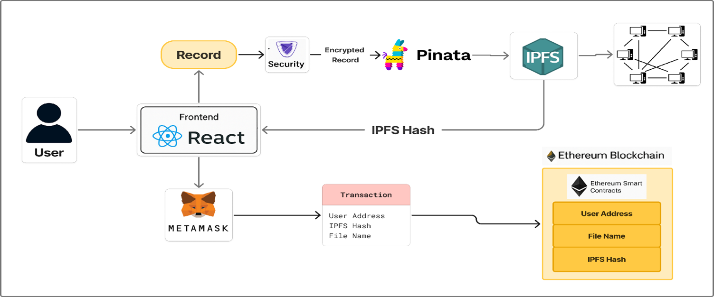

# Decentralized Encrypted File Storage Using Blockchain and IPFS

> A secure, transparent, and decentralized alternative to traditional cloud storage using IPFS, AES Encryption, Ethereum Smart Contracts, and MetaMask.

---

## Abstract

This project presents a **Decentralized File Storage System** that combines **IPFS** for distributed storage, **AES encryption** for file confidentiality, and **Ethereum Blockchain** for immutable metadata management. Users authenticate and interact with the blockchain via **MetaMask**, allowing them to upload, encrypt, and store files securely in a completely decentralized manner.

The system ensures:

- **Client-side encryption** for privacy.
- **Tamper-proof file hashes** via IPFS.
- **Metadata transparency and immutability** using Smart Contracts.
- **User authentication** via decentralized Web3 wallets.

---

## System Architecture




**Core Workflow:**

1. User logs in using MetaMask (Web3 wallet).
2. The file is encrypted on the client side using AES (256-bit).
3. Encrypted file is uploaded to IPFS using Pinata.
4. The resulting IPFS hash, along with filename and wallet address, is stored on Ethereum via a Smart Contract.
5. All interactions are signed through MetaMask for secure, decentralized authentication.

---

## 🛠️ Technologies Used

| Technology    | Purpose                            |
| ------------- | ---------------------------------- |
| **IPFS**      | Decentralized file storage         |
| **AES-256**   | Client-side file encryption        |
| **Ethereum**  | Immutable metadata management      |
| **Solidity**  | Smart contract development         |
| **MetaMask**  | Web3 authentication & transactions |
| **React.js**  | Frontend framework                 |
| **Ethers.js** | Ethereum JavaScript library        |
| **Pinata**    | IPFS pinning service               |

---

## 🚀 Features

- 🔐 AES encryption to protect file contents
- 🌐 IPFS for tamper-proof and distributed file hosting
- 🔗 Ethereum blockchain for transparent metadata storage
- 👛 MetaMask integration for secure authentication
- 📊 Real-time feedback on uploads and transactions
- 📃 Verifiable audit trail using blockchain

---

## 🧪 Installation & Usage

1. **Clone the repository:**
   ```bash
   git clone https://github.com/your-username/decentralized-storage-app.git
   cd decentralized-storage-app
   ```
